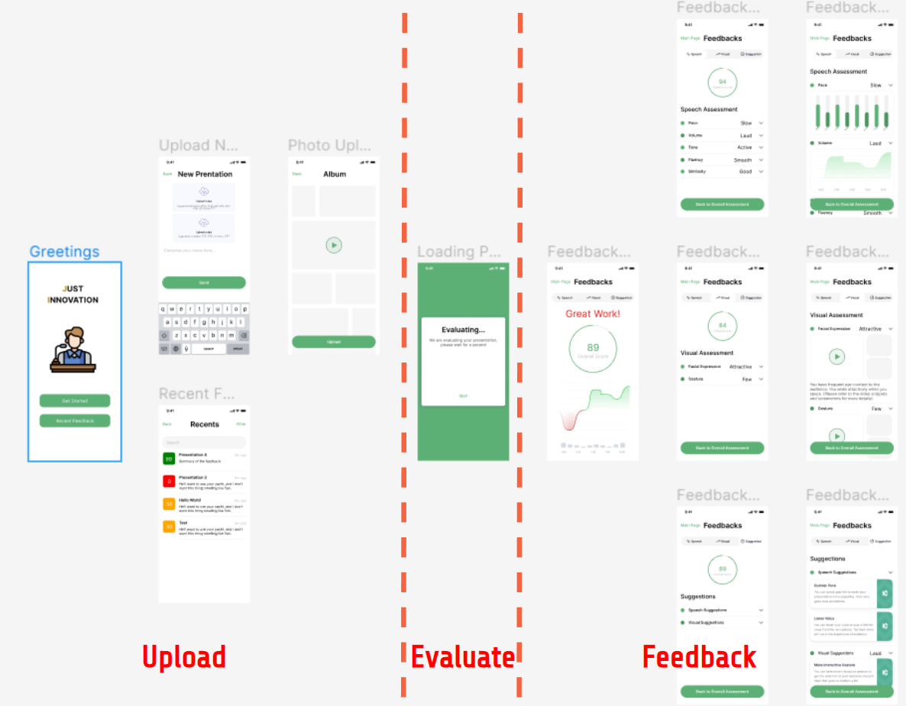
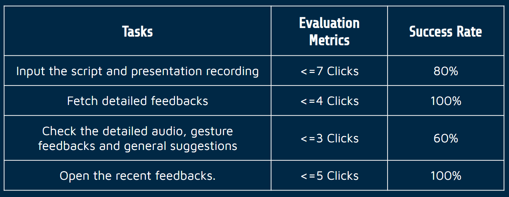

# 441-team-project

## Getting Started

The link to all 3rd-party tools, libraries, SDKs, APIs that may be used in our project are listed below:

+ **Speech to Text API**: [Assembly AI Speech-to-Text](https://www.assemblyai.com/)
+ **Content Analysis**: [NLTK (Natural Language Toolkit)](https://www.nltk.org/)
+ **Audio Analysis**: [Librosa](https://librosa.org/doc/latest/index.html)
+ **Tone Analysis**: [torchaudio](https://pytorch.org/audio/stable/index.html)
+ **Pretrained Multi-task Cascaded Convolutional Networks**: [fer-pytorch](https://pypi.org/project/fer-pytorch/)
+ **Hand Motion Track**: [mediapipe](https://google.github.io/mediapipe/)
+ **Neural Network Framework**: [Pytorch](https://pytorch.org/)
+ **Computer Vision Toolkit**: [OpenCV](https://pypi.org/project/opencv-python/)

### Setting-up Environment

#### Backend Server
The backend server relies on the following packages. Please use pip to install them.
+ `requests`
+ `flask`
+ `ffmpy`

#### Audio API
The audio API relies on the following packages. Please use pip to install them.
+ `numpy`
+ `librosa`
+ `pickle`

#### Content Analysis API
The content analysis API relies on the following package. Please use pip to install them.
+ `nltk`

After installing `nltk`, please run `nltk.download('stopword')` in a python shell. Then, if running a linux machine, please run `flask/api/content/download.sh` directly to download pretrained word embedding files.

#### Frontend APP
If using a virtual device from android studio, please make sure you use the following configurations:

+ **Phone**:

  | Name    | Play Store | Size  | Resolution  | Density |
  | ------- | ---------- | ----- | ----------- | ------- |
  | Pixel 4 | enable     | 5.7'' | 1080 * 2280 | 440dpi  |

+ **System Image**:

  | Release Name | API Level | ABI    | Target                     |
  | ------------ | --------- | ------ | -------------------------- |
  | S            | 31        | x86_64 | Android 12.0 (Google Play) |

+ **Startup orientation**: Portrait

### Running the APP
For backend server, run `python flask/api/api.py`. Please ensure the port number is not occupied. Then before running the frontend, please change the server url accordingly. You should change your url in the following files under the directory `Presentation\app\src\main\java\cn\edu\sjtu\yyqdashen\presentation\`:

+ `MainActivity.kt`
+ `PresentationStore.kt`

After changing the url, launch the APP and enjoy!

## Model and Engine

+ **Story Map**:

+ **System Architecture**:

**Front End**:
Firsly user will send a request which contains a script, rehearsal recording and topic through our front end.

**Back End - Main Handler**:
The main handler maintains connection and listens to front end's message. It fetches all the inputs other engines require and send to them.

**Back End - Vision Handler**:
The vision handler extracs frames from the video and sends them to engines. MTCNN performs facial expression classification. It firstly detects the bounding box for face and outputs a 7-dimensional vector which represenst the probability of neutral, happiness, surprise, sadness, anger, disgust and fear. 

On the other hand, the mediapipe library provides a 3-stage pretrained neural network which is used to detect bounding box for gestures, analyze gestures and perform landmark regression. By tracking the landmark displacements, it outputs a score to reflect gesture usages.

**Back End - Voice Handler**:
The voice handler relies on Speech-To-Text results from Google Cloud. It sends a request along with a piece of audio recording to Google Cloud and gets transcripts. Stop word counts are directly obtained from those transcripts and sent to the feedback handler. Furthermore, the ground true script provided by users can be used to compare with the rehearsals. The 
percentage of correctly recited words is sent to feedback handler.

The voice handler uses librosa library to verity the start and stop time of each word produced by Google API. In this way, the engine calculates a fluent score for every 5 consecutive words. Given that time period, the maximum and minimum waveform magnitudes are checked for each word. The average volume of two consecutive words is passed to feedback handler.

Last but not least, the voice handler uses torchaudio model to learn to analyze positive and negative emotions from audio. The model can also compare sentiment of the audio with topics selected by users. The analysis results are sent to feedback handler.

**Back End - Feedback Handler**:
The feedback handler receives various outputs from voice handler and vision handler. It sends some real-time feedbacks such as fluent score and volume score back to front-end. It also synchronizes other complex analysis and outputs some instructions to front-end.

## APIs and Controller

**Front-End Request Parameters**

| Key           |  Type   | Description                              |
| ------------- |  ------ | ---------------------------------------- |
| `username`    |  String | Current user                             |
| `title` |  String | Presentation Title                       |
| `topic`     | String     | Presentation Topic  |
| `script`    | String     | Presentation Script |
| `recording`  | Media File | Rehearsal Recording  |

**Speech-to-text Request Parameters**

| Key           |  Type   | Description                              |
| ------------- |  ------ | ---------------------------------------- |
| `uri`    |  String | Path to Audio File                            |
| `encoding` |  String | Type of Audio Encoding |
| `languageCode`  | String | Audio Language  |
| `sampleRateHertz`  | String | Sampling rate of audio  |

**Speech-to-text Respond Parameters**

| Key           |  Type   | Description                              |
| ------------- |  ------ | ---------------------------------------- |
| `transcript`    |  String | Transcripts of Audio File                           |
| `confidence` |  Float | Confidence value (0-1)|
| `word`  | dict | Start Time and Stop Time of Each Word in Transcript  |

**Back-End Respond Parameters**

+ **Score**

  | Key             | Type   | Description                                                  |
  | --------------- | ------ | ------------------------------------------------------------ |
  | `overall_score` | Float  | Score from 0 to 100 which evaluates users' general presentation performance |
  | `speech_score`  | String | An assessment from lists [excellent, good, plain, needs work] which evaluates users' overall speech performance |
  | `volume_score`  | Float  | Score from 0 to 10 which evaluates users' speaking volume    |
  | `pace_score`    | Float  | Score from 0 to 100 which evaluates users' presentation speed |
  | `visual_score`  | Float  | Score from 0 to 100 which evaluates users' overall visual performance |
  | `gesture_score` | Float  | Score from 0 to 10 which evaluates users' gesture usages     |
  | `facial_score`  | Float  | Score from 0 to 10 which evaluates users' facial expressions |
  | `flue_score`    | String | Score from 0 to 10 which evaluates the users' speech fluency |
  | memo_score      | Float  | Score from 0 to 100 which evaluates users' level of memorization of the script |

+ **Suggestions**

  | `suggestion`  | String | General suggestion generated from backend based on users' presentation materials |
  | ------------- | ------ | ------------------------------------------------------------ |
  | `gesture_sug` | String | Suggestion on presenter's gesture                            |
  | `face_sug`    | String | Suggestion on presenter's facial expression                  |
  | `vol_sug`     | String | Suggestion on presenter's volume                             |
  | `pace_sug`    | String | Suggestion on presenter's speaking speed                     |
  | `flue_sug`    | String | Suggestion on presenter's speaking fluency                   |
  | `memo_sug`    | String | Suggestion on presenter's level of memorization of the script. |

## View UI/UX

### UI Flow Design

To ensure a great interactive experience for our app users, we divide our user-app interaction into three stages: 

+ Material uploading stage
+ Feedback displaying stage
+ Evaluating stage

As the graph shown below, for the pages on the right side, users are guided to perform uploading operations. For the pages on the left side, users can check all the feedback results freely. These two parts are separated by an evaluating page, in which app is waiting for backend server to process and send back results.

### UIUX Mockup

We use [Figma](https://www.figma.com/) to visualize the UI flow for demonstration. Our UI/UX mockup prototype is linking [here](https://www.figma.com/proto/r0exDEl6ROVZvL7jgnLzoo/UI%2FUX-Workflow?node-id=8%3A2&scaling=scale-down&page-id=0%3A1&starting-point-node-id=8%3A2).

### Usability Test

#### Usability Test configuration

The usability test aims at collecting users' experience and feedbacks on our app. We conducted 6 interviews in total, in which the interviewees tried to use our mockup app to accomplish the pre-designed tasks. 

The predesigned tasks are listed below:

1. Input a script and presentation recording.
2. Fetched detailed feedbacks.
3. Check the detailed audio, gesture feedbacks and general suggestions.
4. Open the recent feedbacks.

To ensure the fairness of the usability testing, all the interviewees are guaranteed to be using our app for the first time. And all the tasks are accomplished by the interviewees themselves without direct guidance given by the interviewer. The usability testing should reflect the users' experience when using our app in the real situation.

#### Findings

The following table is the analysis on how well our pre-designed tasks were accomplished:

From the table above, we can see that most of our tasks are successfully accomplished. Task 3, which asking the user to check the feedback pages, has the lowest success rate. It indicates that the design of our feedback pages should be reorganized to be more user-friendly and easy-to-use.

### Final Design

After collecting and analyzing the results from the usability test, we made some optimization on our UI design to make it more user-friendly. Here is the summary on our changes in the final design:

+ Highlight the navigation bar in the feedback page to make it easier to catch users' attention.

+ Adjust the font size and re-organize the page layout to ensure a better user experience.
+ Change some misleading text to make it more clear, like change between "Back" to "Main Page" in the feedback pages.
+ Add the page title in each page. So the users know where they are.

## Team Roster

The contribution division is detailed in the table below.

| Name         | Contribution                                                 |
| ------------ | ------------------------------------------------------------ |
| Chenshu Zhu  | Build presentation audio rating api. Build content-topic correlation rating api. Build speech-to-text API. Manage git repo. |
| Minhao Li    | Build backend connection; Visual Assessment Algorithm.       |
| Junqi Chen   | Collaborate with Yangqin Yan to work on frontend layout design and frontend activities implementation. Collaborate with Minhao Li to work on connection between frontend and backend. |
| Yuqing Wang  | Collaborate with Minhao Li to work on backend. Allow backend to receive and process audio evaluation request. |
| Yangqin Yan  | Design frontend layout and implement frontend activities.    |
| Jiaming Kang |                                                              |

### Challenges in APP Development 

Throughout the APP development, we met numerous challenges. Yet, all of our challenges can be summarized into "a difficulty in time estimation and project planning". In the frontend part, our unfamiliarity with `kotlin` syntax resulted in time debugging codes involving the okhttp and other 3rd party APIs. We had ZOOM meetings to pool our efforts in debugging, which greatly accelerated the debugging process. In the backend development part, our greatest obstacle was the insufficient computing power provided by the aws EC2 server. Since our project involves machine learning models, the memory on the server soon proved to be not enough. Therefore, we had to develop concurrently on our local laptops and on the cloud, configuring every environment twice to figure out whether any bug was due to memory deficiency or syntatic errors. This helped us learn the importance of documenting our environment configuration. While developing the features, we spent more time than expected reearching existing APIs and open source libraries. Whenever we choose to use an opensource library with state-of-the-art performance, it would involve environment configuration. And if using an API, we need to spend time reading the documentation. Comparing APIs and open source libraries therefore became time-consuming. In retrospect, if we had assigned one member to test each API or library concurrently, we would have saved time. Another lesson learned. While developing ML features, such as hand-gesture and facial expression recognition, we spent much time again preparing environments and running experiments. However, this time seems unavoidable. If anything, we could have done this part as early as possible. In summary, due to our lack of experience in team-coding, we wasted some time in almost every stage of our development. However, after each development process, we learned something that can help us acomplish these tasks faster in the future. We even had the chane of puttong some skills to practise this time. 
